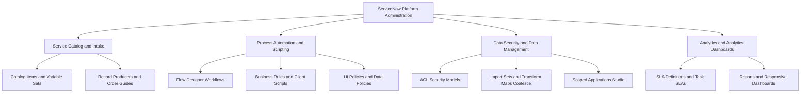

# ServiceNow Enterprise Portfolio
Hands-on ServiceNow administrative and development applications built in a Personal Developer Instance (PDI) while preparing for the Certified System Administrator (CSA) certification.
## Projects Summary
| Project | Key Technologies | Key Features |
|---|---|---|
| [1. Employee Onboarding App](./project-1-employee-onboarding/) | Service Catalog, Flow Designer, Client Scripts (g_form), UI Policies, Notifications | Automated request intake, manager approvals, HR/IT task generation, and conditional equipment provisioning. |
| [2. Incident Auto-Assignment](./project-2-incident-automation/) | Business Rules, Assignment Rules, Client Scripts, SLAs (task_sla), Dashboards | Category-based auto-routing, VIP caller priority override, dynamic form messages, and P1/P2 response/resolution SLAs. |
| [3. Leave Management Scoped App](./project-3-leave-management/) | ServiceNow Studio, Scoped App (x_leave_mgmt), Custom Tables extending task, ACL Security, Data Policies | Isolated application scope, custom data model, table/field-level ACLs (Opened by is Me), and server-side Data Policies. |
| [4. IT Asset Portal and Data Import](./project-4-it-asset-portal/) | Record Producers, Order Guides, Import Sets, Transform Maps, Coalesce, Reports and Dashboards | Direct table record creation, multi-item order bundles, CSV data import pipeline with Coalesce key deduplication, and executive analytics. |
## Technical Competencies Demonstrated

## Repository Navigation
- Each folder contains a detailed README, screenshots, technical documentation, and exported Update Set XML files.
