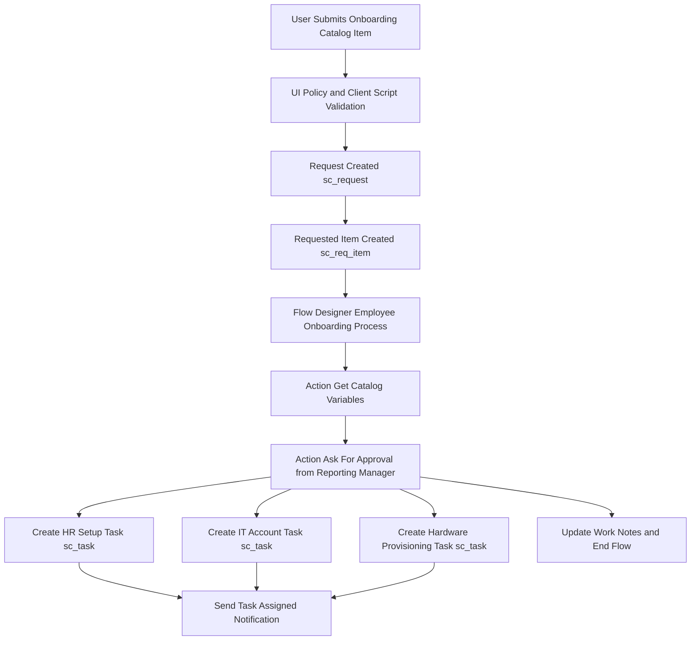

# Project 1: Employee Onboarding Application
## Technical Architecture

## Business Problem and Solution
- Problem: Onboarding required manual email coordination across HR, IT, and managers, causing delays and lack of visibility.
- Solution: Automated Service Catalog intake form with dynamic client-side lookup, Flow Designer approval logic, parallel task generation, and automated email alerts.
## Components Built
### 1. User Infrastructure and Security
- Configured 5 test users with manager-employee hierarchy (john.emp, lisa.mgr, sarah.hr, mike.it, david.asset).
- Built 5 Groups (HR Team, IT Support Team, Hardware Support, Asset Management Team, Managers) and assigned itil and catalog_admin roles to groups to demonstrate Role Inheritance.
### 2. Service Catalog Form
- Category: Employee Onboarding | Catalog Item: New Employee Onboarding Request
- Reusable Variable Set: Employee Personal Information (First Name, Last Name, Email, Phone Number).
- Direct Variables: Start Date, Department, Reporting Manager (Reference to sys_user), Employment Type, Job Title, Needs Laptop (Yes/No), Laptop Type.
### 3. Dynamic Form Logic
- Catalog UI Policy: Show Laptop Type when Laptop is Needed - dynamically shows and enforces Laptop Type when Needs Laptop is Yes.
- Catalog Client Script: Show Manager Info on Selection - onChange script utilizing g_form.getReference to auto-display Manager Email and Department.
### 4. Flow Designer Workflow (Employee Onboarding Process)
- Trigger: Service Catalog submission.
- Get Catalog Variables: Extracts reporting_manager and needs_laptop.
- Ask For Approval: Routes approval to the selected reporting_manager.
- Rejection Logic: Updates work notes and terminates flow if rejected.
- Task Generation: Automatically creates catalog tasks (sc_task) for HR Setup, IT Account creation, and conditional Hardware Provisioning.
## Component Screenshots
### Catalog Item Preview
[Image: Catalog Form Preview](./screenshots/13-catalog-item-form-preview.png)
### Client Script in Action
[Image: Client Script](./screenshots/16-client-script-in-action.png)
### Flow Designer Canvas
[Image: Flow Canvas](./screenshots/17-flow-canvas.png)
### Generated Catalog Tasks
[Image: Catalog Tasks](./screenshots/24-ritm-task-generated.png)
## Exported Update Set
- XML Location: ./update-sets/
