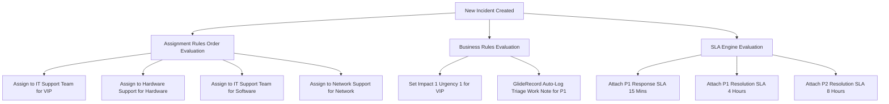

# Project 2: Incident Auto-Assignment System
## Technical Architecture

## Business Problem and Solution
- Problem: Incidents were manually assigned, causing high Mean Time to Resolution (MTTR), unmonitored SLAs, and delayed response for VIP users.
- Solution: Automated incident management system using category and VIP assignment rules, Priority 1 business rules, dynamic field guidance, and SLA tracking timers.
## Components Built
### 1. Assignment Rules
- Order 100: VIP Caller to IT Support Team (First match wins override).
- Order 200: Category Hardware to Hardware Support.
- Order 300: Category Software to IT Support Team.
- Order 400: Category Network to Network Support.
### 2. Business Rules and Client Scripts
- Business Rule (Before Insert): Set Priority 1 for VIP Caller - forces Impact 1 and Urgency 1 when Caller VIP is true.
- Business Rule (After Insert and Update): Log Work Note on P1 Incident - uses GlideRecord API to log auto-triage notes upon P1 detection.
- Client Script (onChange): Category Routing Info Message - displays real-time field messages showing assigned support group.
### 3. SLA Definitions
- P1 Response Time: 15 Minute target, Starts on Priority 1, Stops when State is not New.
- P1 Resolution Time: 4 Hour target, Starts on Priority 1, Stops when Resolved or Closed, Pauses on Hold.
- P2 Resolution Time: 8 Hour target, Starts on Priority 2, Stops when Resolved or Closed, Pauses on Hold.
## Component Screenshots
### Category Auto-Routing Result
[Image: Assignment Result](./screenshots/03-assignment-rule-result.png)
### Category Help Client Script
[Image: Client Script](./screenshots/05-category-client-script.png)
### Active Task SLAs Running
[Image: Task SLAs](./screenshots/07-task-sla-on-incident.png)
