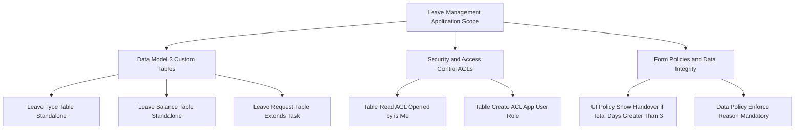

# Project 3: Leave Management Scoped Application
## Technical Architecture

## Business Problem and Solution
- Problem: Managing employee leave inside global scope risked script conflicts and exposed private leave records.
- Solution: Built an isolated Scoped Application in ServiceNow Studio featuring custom table inheritance (Task), record-level security ACLs, and matching UI and Data Policies.
## Components Built
### 1. Data Model (3 Tables)
- Leave Type: Standalone table defining leave categories and annual limits.
- Leave Balance: Standalone table tracking entitlement quotas per employee.
- Leave Request: Custom table extending core Task table to inherit number, state, work_notes, and lifecycle tracking.
### 2. Access Control Lists (ACLs)
- Role Created: x_leave_mgmt user role.
- Record-Level Read ACL: Enforcing role plus dynamic condition Opened by is Me so users only access their own requests.
### 3. UI Policy vs Data Policy
- UI Policy (Client-Side): Dynamically shows and enforces Handover Person as mandatory when Total Days is greater than 3.
- Data Policy (Server-Side): Enforces Reason as mandatory across Form UI, Excel Data Imports, and REST Web Services.
## Component Screenshots
### Studio Custom App Dashboard
[Image: Studio App](./screenshots/01-p3-studio-app-created.png)
### Custom Tables Data Model
[Image: Custom Tables](./screenshots/02-p3-custom-tables-created.png)
### Dynamic Read ACL Security Rule
[Image: Read ACL](./screenshots/03-p3-acl-read-rule.png)
### Live Form Behavior
[Image: Leave Form](./screenshots/05-p3-leave-request-form.png)
