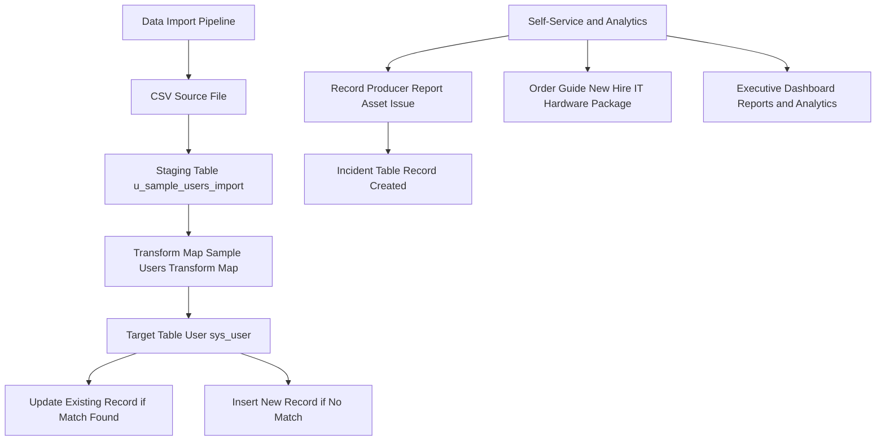

# Project 4: IT Asset Request Portal and Data Management
## Technical Architecture

## Business Problem and Solution
- Problem: Lack of simplified self-service intake tools for broken assets, and risk of generating duplicate user records during bulk CSV imports.
- Solution: Built end-user Record Producers and Order Guides, executed data imports using Transform Maps with Coalesce deduplication logic, and built executive reporting dashboards.
## Components Built
### 1. Record Producer and Order Guide
- Record Producer (Report Asset Issue): Maps user variables directly to the Incident target table via script.
- Order Guide (New Hire IT Hardware Package): Bundles hardware requests into a single unified request interface.
### 2. Data Import Set and Transform Map
- Source: Loaded sample_users_import.csv into staging table u_sample_users_import.
- Transform Map: Mapped columns to target table User sys_user.
- Coalesce Logic: Set Coalesce true on email field. Verified import run resulted in 1 Insert (new user Alex Taylor) and 1 Update (existing user updated without duplication).
### 3. Executive Reporting and Dashboard
- Report 1: Incidents by Category (Pie Chart).
- Report 2: Open Critical Incidents (Single Score Widget).
- Report 3: Leave Requests Overview (Bar Chart).
- Dashboard: Created IT Operations and HR Dashboard combining all 3 widgets on a responsive canvas.
## Component Screenshots
### Record Producer Output
[Image: Record Producer](./screenshots/01-p4-record-producer-incident.png)
### Transform Map Coalesce Configuration
[Image: Transform Coalesce](./screenshots/03-p4-transform-map-coalesce.png)
### Import Execution Log
[Image: Import Results](./screenshots/04-p4-import-results.png)
### Executive Dashboard
[Image: Dashboard](./screenshots/05-p4-executive-dashboard.png)
